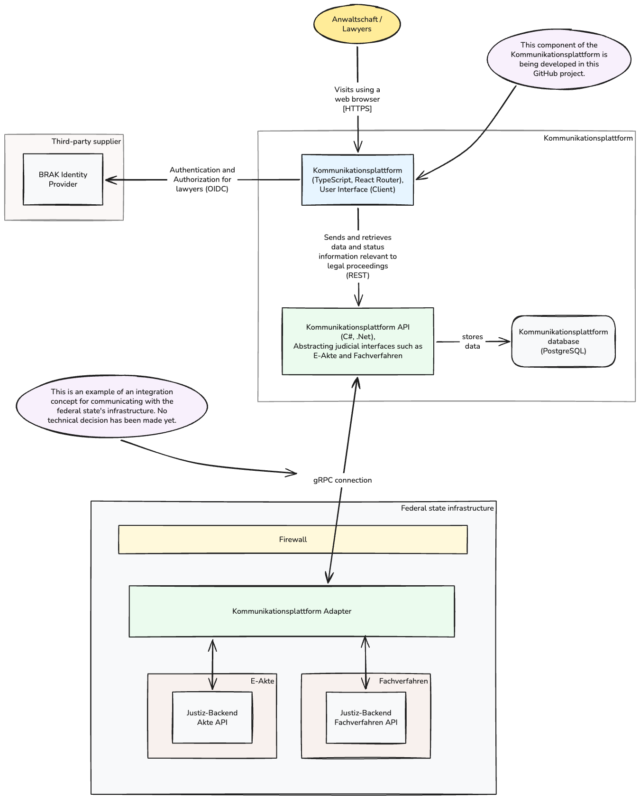

## Architecture

This is a full-stack application developed using React Router and Node.js. The app was initially designed without a persistent database layer and functions exclusively as a client that uses existing software solutions in the justice IT landscape as needed (e.g., the [BRAK](https://www.brak.de/)-Identity-Provider). The application uses an external REST API ([Justiz KomPla API Swagger](https://app.kompla-justiz.sinc.de/main/swagger/index.html)) to dynamically retrieve, process, and transfer data.

Main components:

- [React Router](https://reactrouter.com/): In Framework mode, server-side rendering, routing
- [Node.js](https://nodejs.org/): Backend runtime
- [KERN](https://www.kern-ux.de/): Design system
- [zod](https://zod.dev/): Validation
- [Vitest](https://vitest.dev/): Unit and integration testing
- [Playwright](https://playwright.dev/): End-to-end testing

<!--
Edit this diagram by importing the .png into [https://excalidraw.com](https://excalidraw.com).
When exporting, choose "embed scene".
-->
