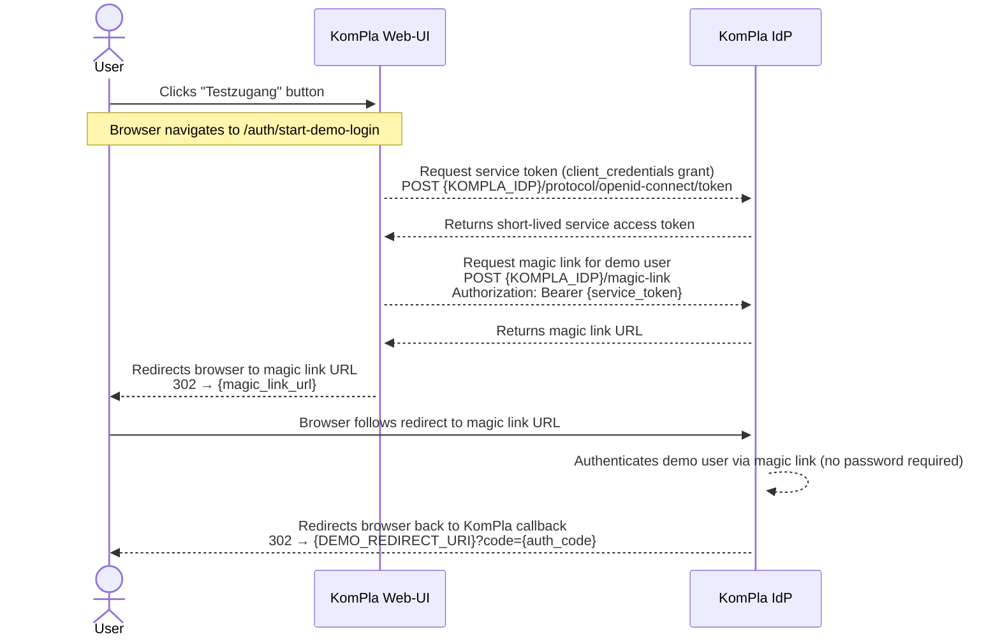
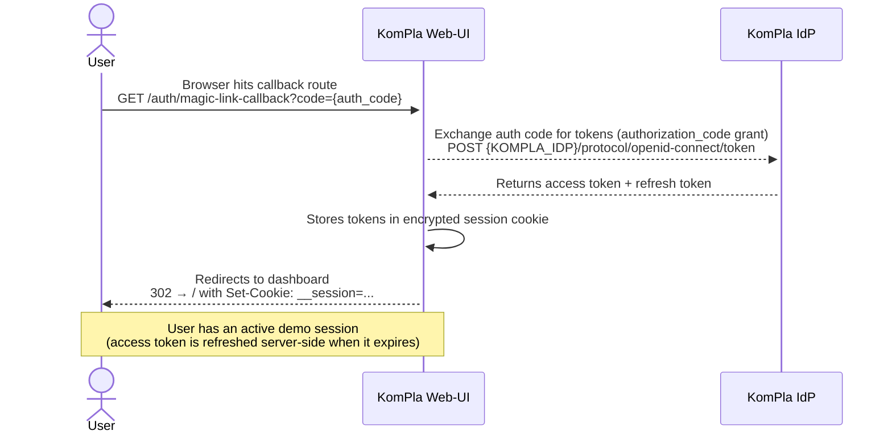
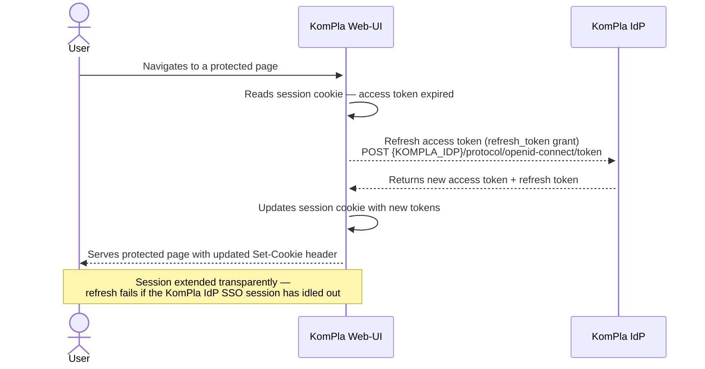

# Demo login (Testzugang)

## How does the demo login work?

The demo login ("Testzugang") allows access to KomPla with a pre-configured demo user without requiring beA credentials. The entire authentication flow is server-side: the browser never handles auth codes or credentials directly.

One identity provider is involved: the **KomPla IdP** (Keycloak realm `kompla-dev`), accessed via the `magic-link` client — a Keycloak client within the same realm that is specifically configured with the magic link extension for demo access. It:

- Issues a short-lived **service token** via the `client_credentials` grant to the KomPla server.
- Generates a **magic link** — a single-use Keycloak login URL that authenticates the demo user without a password prompt.
- Exchanges the resulting auth code for an **access token** and **refresh token** for the demo user.

Because the resulting access token is already scoped for the KomPla API, it can be used for API calls directly — no token exchange step is needed (unlike the regular beA login flow).

### Phase 1 — Obtain magic link and redirect browser to KomPla IdP

### Phase 2 — Exchange auth code for tokens and establish session

### Token refresh

When the access token expires, the server refreshes it transparently without any browser redirect:

