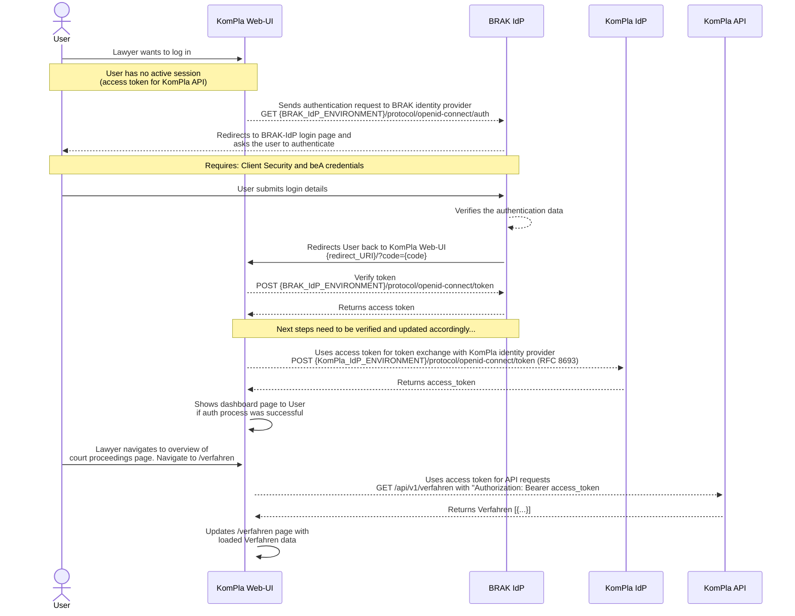

# Identity provider

## Log in with BRAK identity provider, then display court proceedings for logged-in lawyer

```mermaid
sequenceDiagram
    actor User
    User->>+KomPla Web-UI: Lawyer wants to log in
    Note over User,KomPla Web-UI: User has no active session<br/>(access token for KomPla API)
    KomPla Web-UI-->>+BRAK IdP: Sends authentication request to BRAK identity provider<br/>GET {BRAK_IdP_ENVIRONMENT}/protocol/openid-connect/auth
    BRAK IdP-->>User: Redirects to BRAK-IdP login page and<br/>asks the user to authenticate
    Note over BRAK IdP,User: Requires: Client Security and beA credentials
    User->>BRAK IdP: User submits login details
    BRAK IdP-->>BRAK IdP: Verifies the authentication data
    BRAK IdP->>KomPla Web-UI: Redirects User back to KomPla Web-UI<br/>{redirect_URI}/?code={code}
    KomPla Web-UI-->>BRAK IdP: Verify token<br/>POST {BRAK_IdP_ENVIRONMENT}/protocol/openid-connect/token
    BRAK IdP-->>KomPla Web-UI: Returns access token
    Note over BRAK IdP,KomPla Web-UI: Next steps need to be verified and updated accordingly...
    KomPla Web-UI-->>+KomPla IdP: Uses access token for token exchange with KomPla identity provider<br/>POST {KomPla_IdP_ENVIRONMENT}/protocol/openid-connect/token (RFC 8693)
    KomPla IdP-->>+KomPla Web-UI: Returns access_token
    KomPla Web-UI->>+KomPla Web-UI: Shows dashboard page to User<br/>if auth process was successful
    User->>+KomPla Web-UI: Lawyer navigates to overview of<br/>court proceedings page. Navigate to /verfahren
    KomPla Web-UI-->>+KomPla API: Uses access token for API requests<br/>GET /api/v1/verfahren with "Authorization: Bearer access_token
    KomPla API-->>+KomPla Web-UI: Returns Verfahren [{...}]
    KomPla Web-UI->>+KomPla Web-UI: Updates /verfahren page with<br/>loaded Verfahren data
```
