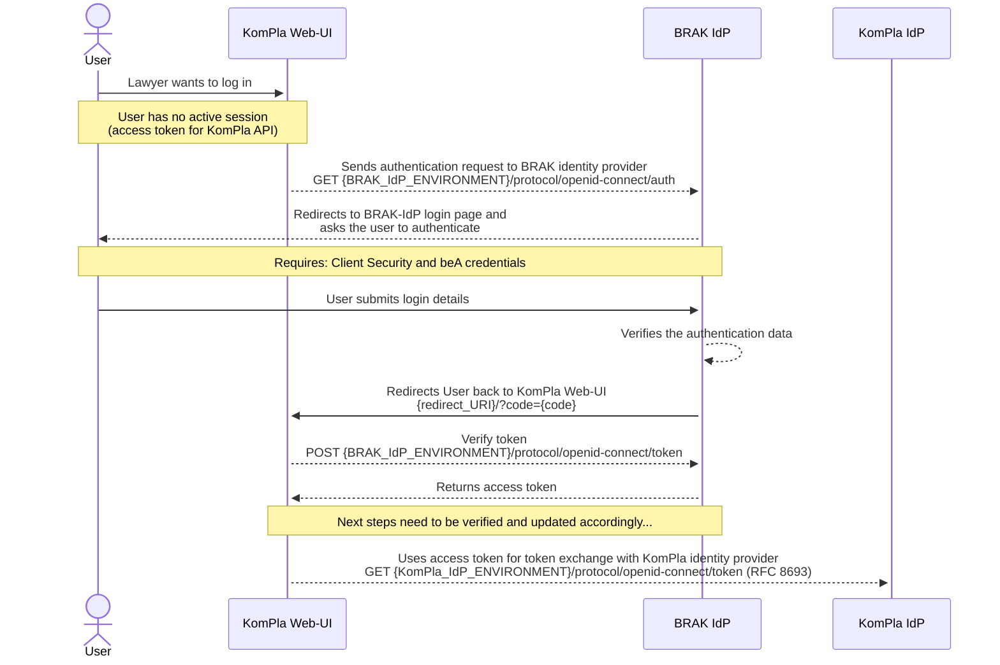

# Identity provider

## Login via BRAK IdP

```mermaid
sequenceDiagram
    actor User
    User->>+KomPla Web-UI: Lawyer wants to log in
    Note over User,KomPla Web-UI: User has no active session<br/>(access token for KomPla API)
    KomPla Web-UI-->>+BRAK IdP: Sends authentication request to BRAK identity provider<br/>GET {BRAK_IdP_ENVIRONMENT}/protocol/openid-connect/auth
    BRAK IdP-->>User: Redirects to BRAK-IdP login page and<br/>asks the user to authenticate
    Note over BRAK IdP,User: Requires: Client Security and beA credentials
    User->>BRAK IdP: User submits login details
    BRAK IdP-->>BRAK IdP: Verifies the authentication data
    BRAK IdP->>KomPla Web-UI: Redirects User back to KomPla Web-UI<br/>{redirect_URI}/?code={code}
    KomPla Web-UI-->>BRAK IdP: Verify token<br/>POST {BRAK_IdP_ENVIRONMENT}/protocol/openid-connect/token
    BRAK IdP-->>KomPla Web-UI: Returns access token
    Note over BRAK IdP,KomPla Web-UI: Next steps need to be verified and updated accordingly...
    KomPla Web-UI-->>+KomPla IdP: Uses access token for token exchange with KomPla identity provider<br/>GET {KomPla_IdP_ENVIRONMENT}/protocol/openid-connect/token (RFC 8693)
```
