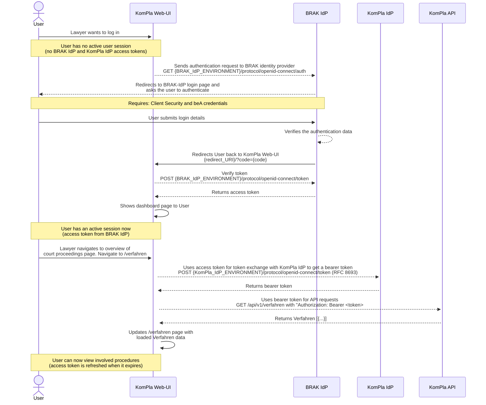

# Identity provider

## What is the login process for lawyers? How is access granted to the proceedings involved?

The following sequence diagram shows the interaction between the web UI and the identity providers (IdP). Two identity providers are used:

- **BRAK IdP**
  - Access system for all lawyers licensed in Germany and their employees for exchanging messages with the judiciary and other parties involved in electronic legal transactions.
- **KomPla IdP**
  - Every request to the protected **KomPla API** requires an Authorization header ([Bearer authentication](https://swagger.io/docs/specification/v3_0/authentication/bearer-authentication/)) containing an access token provided by the **KomPla IdP** through token exchange ([RFC 8693](https://www.rfc-editor.org/rfc/rfc8693.html)). This means that the KomPla Web UI (application) exchanges an access token it has received from the BRAK IdP for the currently logged-in user (e.g., a lawyer) for a new token that is used to call the backend service (KomPla API).

