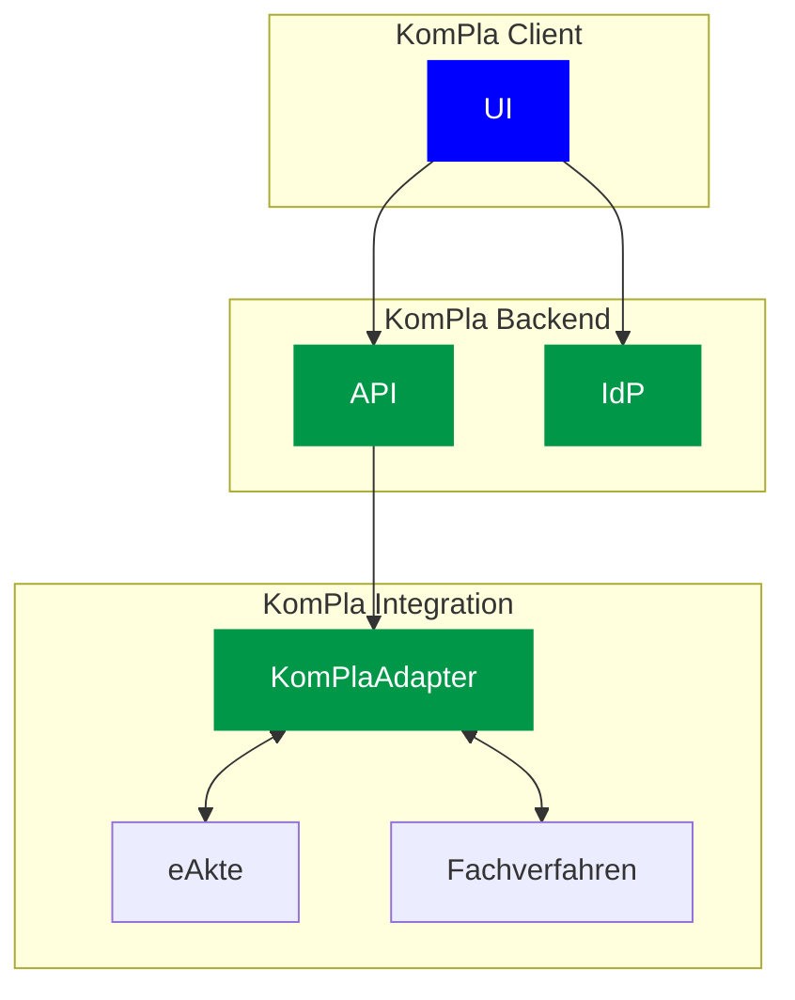

# System architecture of Kommunikationsplattform

## KomPla quick overview

- UI:
  - KomPla web user interface, stateless
- Backend:
  - KomPla API
  - KomPla IdP
- Technical integration at the state/regional level (Bundesland/Gericht)
  - KomPla Adapter

## KomPla C4 system overview

```mermaid
    C4Context
      title System Context diagram for Kommunikationsplattform
      Boundary(b0, "KomPla") {
        Person(userA, "KomPla User A", "A lawyer with a BRAK account.")
        Person(userB, "KomPla User B", "A legal expert,<br/>without BRAK account.")

        System_Boundary(b1, "KomPla Frontend") {
          System(KomPlaUI, "KomPla Client (Web UI)", "Allows our users to view information about their court proceedings,<br/>and to hand in a lawsuite or update documents for a Verfahren.")
        }

        System_Boundary(b2, "BRAK") {
          System(BeAPortal, "beA Portal Client (Web UI)", "Allows lawyers to authenticate with,<br/>their beA login credentials.")
          System(BRAKIdP, "BRAK Identity Provider (IdP)", "Checks the authentication data, generates identity token, returns it to Fachverfahren.")
        }

        Boundary(b3, "KomPla Backend") {
          System(KomPlaAPI, "KomPla API", "Allows (external) systems to interact with the KomPla.")
          System(KomPlaIdP, "KomPla Identity Provider (IdP)", "Keycloak based IdP within KomPla, acts as an identity broker.<br/>Redirects to external identity providers, such as BRAK IdP or SAmOA,")

          System_Boundary(b4, "KomPla Main") {
            System(KomPlaMain, "KomPla Main System", "Responsible for providing all platform-related functionalities?")
            SystemDb(KomPlaDB, "KomPla Database", "Stores platfrom-related data?")
          }
        }

        Boundary(b5, "Technical Tntegration", "Access to state infrastructure") {
          System(Firewall, "Network", "Tbd: Access, Firewall, Network options for pilot courts.")
          System(KomPlaAdapter, "KomPla Adapter", "Tbd: Enables access to on-site systems")
          System(KomPlaJBA, "KomPla Justice Backend API", "Tbd: Enables communication with on-site systems")
          System(FachverfahrenA, "Fachverfahren<br/>eAkte", "Tbd")
          System(FachverfahrenB, "Fachverfahren<br/>Anwendung", "Tbd")
          System(FachverfahrenC, "Fachverfahren<br/>Text System", "Tbd")
        }
      }

      Rel(userA, KomPlaUI, "Uses")
      UpdateRelStyle(userA, KomPlaUI, $offsetX="-15", $offsetY="-50")
      Rel(userB, KomPlaUI, "Uses")
      UpdateRelStyle(userB, KomPlaUI, $offsetX="-10", $offsetY="-50")
      BiRel(KomPlaUI, KomPlaAPI, "Uses")
      UpdateRelStyle(KomPlaUI, KomPlaAPI, $offsetX="0", $offsetY="150")
      BiRel(userA, BeAPortal, "Login", "BRAK IdP")
      UpdateRelStyle(userA, BeAPortal, $offsetX="20", $offsetY="115")
      BiRel(userB, KomPlaIdP, "Login", "KomPla IdP")
      UpdateRelStyle(userB, KomPlaIdP, $offsetX="-30", $offsetY="-40")
      BiRel(KomPlaUI, KomPlaIdP, "Token Exchange", "OAuth 2.0 (RFC 8693)")
      UpdateRelStyle(KomPlaUI, KomPlaIdP, $offsetX="-80", $offsetY="120")
      BiRel(KomPlaUI, BRAKIdP, "Authorization<br/>Code flow", "OAuth 2.0")
      UpdateRelStyle(KomPlaUI, BRAKIdP, $offsetX="-50", $offsetY="-40")
      BiRel(KomPlaAPI, KomPlaMain, "Processes requests,<br/>handles business logic,<br/>returns repsponses")
      UpdateRelStyle(KomPlaAPI, KomPlaMain, $offsetX="-10", $offsetY="-30")
      BiRel(KomPlaMain, KomPlaDB, "Data flow")
      UpdateRelStyle(KomPlaMain, KomPlaDB, $offsetX="-25", $offsetY="-20")
      BiRel(KomPlaMain, Firewall, "tbd")
      BiRel(Firewall, KomPlaAdapter, "tbd")
      BiRel(KomPlaAdapter, KomPlaJBA, "tbd")
      BiRel(KomPlaJBA, FachverfahrenA, "tbd")
      BiRel(KomPlaJBA, FachverfahrenB, "tbd")
      BiRel(KomPlaJBA, FachverfahrenC, "tbd")

      UpdateLayoutConfig($c4ShapeInRow="3", $c4BoundaryInRow="1")
```

